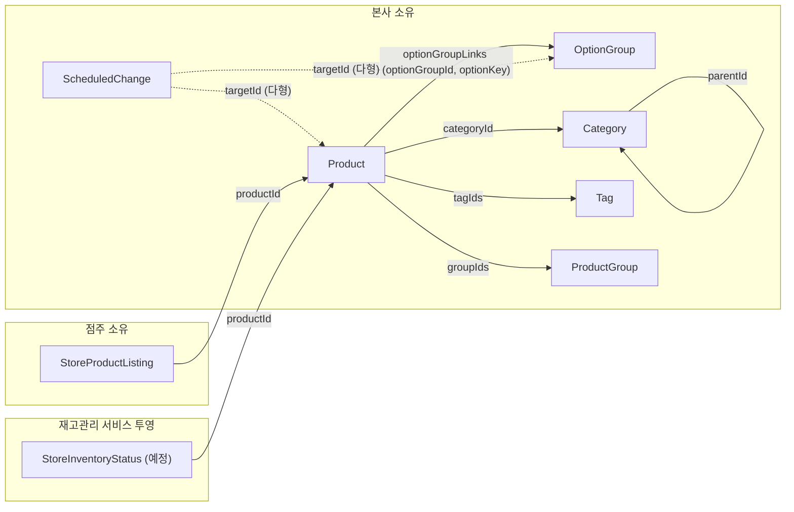
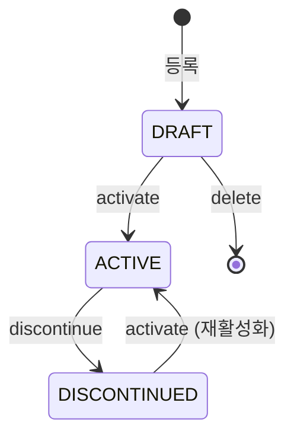
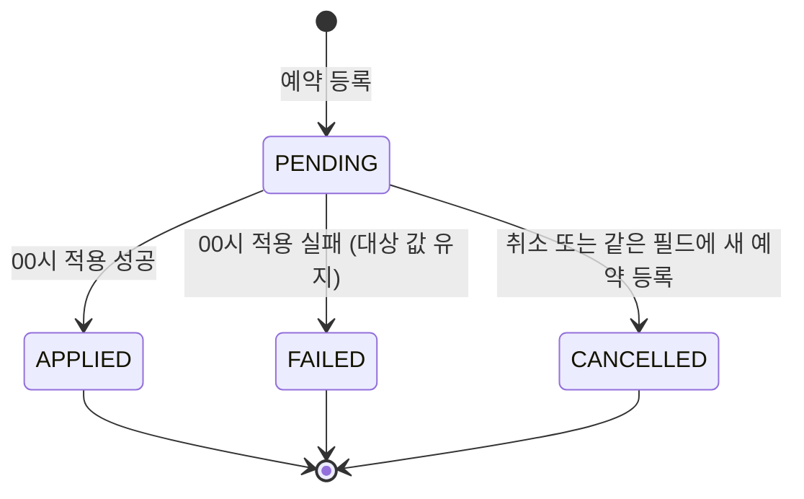

# Catalog 도메인 모델

> 문서별 역할과 수정 순서는 [문서 안내](README.md)를 참고한다.

[요구사항](requirements.md)의 규칙을 어떤 애그리거트가 어떻게 지키는지 다룬다. 규칙 원문은 요구사항 절 번호로 참조하고, 필드·컬럼 목록은 [ERD](erd.md)와 코드를 본다.

## BC 경계

- **Store(매장)**: 별도의 Store Management BC로 분리한다. Catalog Service는 `storeId`만 참조하며, 매장의 본질적 정보(주소, 영업시간, 계약 등)는 다루지 않는다.
- **Product**: Catalog Service가 계속 소유한다. 다른 서비스(POS, 정산 등)가 상품 정보를 필요로 하는 경우, Catalog Service가 이벤트를 발행하고 해당 서비스가 구독하는 방식으로 연동한다. Product 자체를 별도 BC로 분리하지 않는다.
- **"어떤 매장이 어떤 상품을 파는가"**: Catalog Service가 소유한다 (`StoreProductListing`). 이는 "상품이 어떻게 판매되는가"에 대한 관심사이지 "매장이라는 개체 자체"에 대한 관심사가 아니므로, Store BC가 아닌 Catalog BC에 속한다.

```
Store Management BC (별도, 미착수)
└─ Store: storeId, 주소, 영업시간, 가맹점주 계약 정보, 개설/폐점 상태 등
   (storeId를 발급하는 유일한 출처)

Catalog Service BC (본 문서 대상)
├─ Product, Option, OptionGroup, Product_OptionGroup, Category, Tag, ProductGroup, ScheduledChange
├─ StoreProductListing (storeId 참조)
└─ StoreInventoryStatus (재고관리 서비스 이벤트 투영, storeId·productId 참조)

재고관리 서비스 BC (별도)
└─ 매장 재고의 원본. storeId, productId 참조, 재고 변동 이벤트 발행
```

## 애그리거트 지도



애그리거트끼리는 ID로만 참조한다. `storeId`는 모두 Store BC가 발급한 값이며 Catalog는 매장 자체를 모델링하지 않는다.

| 애그리거트 | 소유자 | 책임 | 내부 구성 |
|---|---|---|---|
| Product | 본사 | 상품 정의, 상태 전이(활성화·단종·삭제), 판매 범위, 옵션 그룹 연결 순서와 상품별 옵션 예외 | `ProductOptionGroupLink`(내부 엔티티), `OptionOverride`(VO), `StoreScope`(VO) |
| OptionGroup | 본사 | 여러 상품이 공유하는 옵션 묶음. 옵션 목록의 유효성(최소 1개, 키 유일) | `Option`(VO) |
| Category | 본사 | 2단계 카테고리 계층 | `TopLevelCategory` / `ChildCategory` |
| Tag | 본사 | 마케팅 라벨. 이름으로 재사용 | — |
| ProductGroup | 본사 | 내부 관리용 단일 레벨 분류 | — |
| ScheduledChange | 본사 (적용은 예약 배치) | 필드 단위 예약의 수명(대기 → 적용완료/실패/취소) | — |
| StoreProductListing | 점주 | 매장별 노출·진열 순서, 재고 미추적 상품의 수동 품절. 점주가 처음 바꿀 때 생성(Lazy) | — |
| StoreInventoryStatus (예정, #25) | 재고관리 서비스 | 재고 추적 상품의 매장별 재고 유무. 재고 이벤트로만 갱신 | — |

매장별 노출 판단(요구사항 3장)은 Product, StoreProductListing, StoreInventoryStatus를 함께 봐야 하므로 어느 한 애그리거트에 두지 않고 도메인 서비스 `ProductVisibilityPolicy`에 둔다.

## 변경 메커니즘

### 변경 경로 (요구사항 1.3, 1.4, 1.6~1.9)

| 대상 | 경로 |
|---|---|
| 상품 정보 (상태 제외 전부) | 즉시 반영(PUT) 또는 필드 단위 예약 |
| 상품 상태 | 전용 액션 activate/discontinue만. 즉시 또는 예약 |
| 옵션 그룹의 이름·선택 방식·필수 여부 | 즉시 반영만 |
| 옵션 그룹의 옵션 목록 | 즉시(목록 전체 교체) 또는 예약(목록 전체 스냅샷) |
| 상품-옵션 그룹 연결(순서, 상품별 예외) | 즉시 또는 예약 |
| 카테고리·태그·상품 그룹 이름 | 즉시 반영만 |

- **즉시 반영(PUT)**: 요청 시점에 입력된 값 전체로 대상을 그 자리에서 교체한다.
- **예약**: 필드 단위로 등록하며 지정한 날짜 00시에 적용한다. 같은 대상·같은 필드의 대기 예약은 최대 1건이고 새 예약이 기존 것을 대체한다. 조회 시 현재 값과 예약 값을 함께 보여 준다. 적용에 실패하면 값을 바꾸지 않고 실패만 기록한다.
- **상태 전용 액션**: 상태는 PUT이나 일반 예약 대상이 아니다. 허용된 전이만 가능하고 같은 상태로의 재요청은 거부한다(아래 상태 전이 참고).

### 모델링 메커니즘

- **Lazy 생성**: StoreProductListing은 점주가 처음 커스터마이징할 때 생긴다. row가 없으면 "기본값(노출)으로 취급 중"이다.
- **재고 상태 투영**: 재고 추적 상품의 품절 여부는 StoreProductListing이 아니라 StoreInventoryStatus에 둔다. 재고 이벤트를 상품 상태·판매 범위와 무관하게 항상 반영하고, 판매 범위 변경으로 개별 설정이 삭제돼도 지우지 않는다. row가 없으면 재고 0(품절)이다.
- **옵션 구조**: Option(개별 옵션)과 OptionGroup(선택 방식·필수 여부를 가진 묶음)을 분리하고, Product는 ProductOptionGroupLink로 옵션 그룹을 참조한다. 예외가 없으면 옵션 그룹의 구성과 가격을 그대로 따르고, 필요한 상품만 `OptionOverride`(가격/제외)로 예외를 둔다. "기본 선택값" 개념은 없고 필수·복수 여부만 표현한다. 필수 그룹에 옵션이 1개면 자동 선택으로 본다.
- **최종 판매가**: 기준가 + 선택한 옵션들의 가격 합(상품별 가격 예외 반영). 옵션 가격과 예외 가격이 0 이상이므로 기준가 아래로 내려가지 않는다.
- **옵션 키(optionKey)**: 옵션 목록 교체로 물리 id가 바뀌어도 상품별 예외의 참조가 끊기지 않도록 유지되는 논리 식별자. 교체로 사라진 키의 예외는 함께 삭제한다(요구사항 1.9).

## 불변식과 강제 위치

애그리거트 혼자 지킬 수 있는 규칙은 애그리거트 메서드 안에서 강제하고, 다른 애그리거트나 저장소를 봐야 판단할 수 있는 규칙은 application 레이어가 필요한 값을 조회해 넘기거나 직접 검증한다.

### 애그리거트 내부에서 강제

| 애그리거트 | 불변식 | 위반 시 |
|---|---|---|
| Product | `ACTIVE` 상품은 다시 활성화할 수 없다 | `InvalidProductStatusTransitionException` |
| Product | `ACTIVE`가 아닌 상품은 단종할 수 없다 (`DRAFT → DISCONTINUED` 불가) | `InvalidProductStatusTransitionException` |
| Product | `DRAFT`가 아닌 상품은 삭제할 수 없다 | `ProductNotDeletableException` |
| Product | 같은 옵션 그룹을 두 번 연결할 수 없다 (등록 시점 포함) | `DuplicateOptionGroupLinkException` |
| Product | 연결되지 않은 옵션 그룹에는 예외(가격/제외)를 지정할 수 없다 | `ProductOptionGroupNotLinkedException` |
| Product | 옵션 그룹 순서 변경 요청은 연결된 옵션 그룹 전체를 정확히 한 번씩 담아야 한다 (일부만 담으면 빠진 연결과 예외 설정이 사라지므로 거부) | `InvalidOptionGroupOrderException`, 연결되지 않은 그룹이 있으면 `ProductOptionGroupNotLinkedException` |
| Product | 상품별 옵션 예외는 옵션 키당 최대 1건 (새 예외가 기존 것을 대체) | — (구조로 보장) |
| OptionGroup | 옵션은 최소 1개 (생성·교체 모두) | `EmptyOptionGroupException` |
| OptionGroup | 그룹 안에서 optionKey는 유일 | `DuplicateOptionKeyException` |
| Category | 2단계 계층만 허용 — 자기 자신을 부모로 지정 불가, 하위를 가진 대분류는 소분류가 될 수 없음 | `InvalidParentCategoryException` |
| ScheduledChange | `PENDING` 상태에서만 취소/적용/실패 처리 가능 | `NoPendingScheduleException` / `InvalidScheduleStatusTransitionException` |
| StoreProductListing | 재고 추적 상품의 품절 상태는 점주가 바꿀 수 없다 | `StockStatusNotManuallyEditableException` |
| Money | 금액은 0 이상 (기준가, 옵션 가격, 상품별 가격 예외 모두) | `InvalidMoneyAmountException` |

### application 레이어에서 강제 (cross-aggregate)

| 규칙 | 필요한 정보 | 처리 방식 |
|---|---|---|
| 제외 지정으로 상품의 선택 가능 옵션이 0개가 되면 거부 | OptionGroup의 전체 옵션 목록 | application이 남는 옵션 키 집합을 계산해 `Product.excludeOption()`에 전달, 비었으면 도메인이 거부 |
| 옵션 변경으로 어떤 연결 상품의 선택 가능 옵션이 0개가 되면 거부 | 이 그룹을 연결한 모든 상품의 제외 설정 | application이 연결 상품 전체를 조회해 검증 (`NoSelectableOptionException`) |
| 옵션 변경으로 사라진 옵션 키의 상품별 예외는 함께 삭제 (요구사항 1.9) | 이 그룹을 연결한 모든 상품의 예외 | 같은 트랜잭션에서 application이 연결 상품마다 `Product.removeOverride()` 호출 |
| 상품별 예외는 옵션 그룹에 존재하는 옵션 키에만 지정 가능 | OptionGroup의 옵션 키 목록 | application 검증 (예외 예약은 적용 시점에 다시 확인, 없으면 `실패`) |
| 하위 카테고리를 가진 대분류는 소분류로 이동 불가 | 하위 카테고리 존재 여부 | application이 조회해 `becomeChildOf(hasChildren)`에 전달 |
| 상품이 참조 중인 소분류 삭제 불가 | 참조 상품 존재 여부 | application 검증 (`CategoryStillReferencedException`) |
| 소분류를 가진 대분류 삭제 불가 | 하위 카테고리 존재 여부 | application 검증 (`CategoryHasChildrenException`) |
| 상품이 연결한 옵션 그룹 삭제 불가 | 연결 상품 존재 여부 | application 검증 (`OptionGroupStillReferencedException`) |
| 재고 추적 상품의 품절은 점주가 수정 불가 | `Product.tracksInventory` | application이 조회해 `changeStockStatusByOwner(tracksInventory)`에 전달 |
| 판매 범위 대상 매장은 실제 존재하는 매장이어야 함 | Store BC | `ValidateStoreExistsPort`로 외부 검증 |
| 동일 대상·필드의 PENDING 예약은 최대 1건 | 기존 PENDING 예약 | application이 기존 예약을 잠그고(`FOR UPDATE`) 취소 후 새로 등록, DB 부분 UNIQUE 제약으로 이중 보장 |
| 태그 이름은 유일 (같은 이름이면 재사용) | 기존 태그 | `TagRegistrar`(도메인 서비스)가 `findOrCreateByName`으로 처리 |

## 상태 전이

### Product



- 전이는 전용 액션(activate/discontinue)으로만 일어나며 즉시/예약 둘 다 지원한다.
- `DRAFT → DISCONTINUED`는 없다. 등록 취소는 삭제로 한다.
- 삭제는 `DRAFT`에서만 가능하며 복구할 수 없다.
- `DISCONTINUED` 상태에서도 상태 외 모든 정보는 수정할 수 있다.

### ScheduledChange



- `APPLIED` / `FAILED` / `CANCELLED`는 종료 상태로, 이후 어떤 전이도 허용하지 않는다.

### StoreProductListing

- `visibility`(VISIBLE ⇄ HIDDEN): 점주가 자유롭게 전환.
- `stockStatus`(ON_SALE ⇄ SOLD_OUT): 재고 미추적 상품만 사용하며 점주가 수동 전환.
- 두 값은 서로 독립이다. 품절이어도 숨기지 않았다면 노출되며 구매 불가로 표시된다.

### StoreInventoryStatus (예정)

- 최초: row 없음 = 품절 (재고 0).
- 재고 있음 이벤트(입고·재입고) → `ON_SALE`, 재고 없음 이벤트(소진·폐기) → `SOLD_OUT`.
- 상품이 단종 중이거나 매장이 판매 범위 밖이어도 전이는 계속 일어난다.

## 도메인 이벤트

| 이벤트 | 발행 시점 | 페이로드 | 반응 (구독 측) |
|---|---|---|---|
| `ProductActivated` | `Product.activate()` (최초 활성화·재활성화) | productId | 외부 서비스(POS 등)에 상품 판매 개시 전파 |
| `ProductDiscontinued` | `Product.discontinue()` | productId | 외부 서비스에 판매 중단 전파 |
| `ProductStoreScopeChanged` | `Product.changeStoreScope()` | productId, newScope | 기존 StoreProductListing과 newScope를 대조해 대상에서 빠진 매장의 개별 설정 삭제 (재포함되어도 복원하지 않음, StoreInventoryStatus는 유지) |
| `TagDeleted` | `Tag.delete()` | tagId | 이 태그를 참조하던 모든 상품에서 태그 제거 |
| `ProductGroupDeleted` | `ProductGroup.delete()` | groupId | 이 그룹을 참조하던 모든 상품에서 참조 제거 |

- 이벤트는 애그리거트가 `registerEvent()`로 쌓아 두고, 저장 후 application이 꺼내 발행한다.
- `ProductStoreScopeChanged`가 "제외된 매장 목록" 대신 새 판매 범위만 담는 이유: domain은 전체 매장 목록을 모르므로 어떤 매장이 빠졌는지 계산할 수 없다.

### 외부에서 받는 이벤트

| 이벤트 (재고관리 서비스) | 반응 |
|---|---|
| 매장 재고 생김 (입고·재입고) | StoreInventoryStatus를 `ON_SALE`로 upsert |
| 매장 재고 없음 (소진·폐기) | StoreInventoryStatus를 `SOLD_OUT`으로 upsert |

- 상품 상태·판매 범위와 무관하게 항상 반영한다. Catalog에 없는 상품의 이벤트는 기록만 하고 무시한다.
- 발생 시각이 이미 반영한 것보다 오래된 이벤트는 무시한다(중복 수신·순서 역전 대비).
- 이벤트 형식과 메시징 기술은 미정이다.

## 주요 결정

### 단종·재활성화 때 매장 개별 설정을 바꾸지 않는다 (요구사항 1.3, 2.6)

단종해도 개별 설정(`visibility`)을 숨김으로 바꾸지 않고 보존한다. 노출 판단 1단계에서 `Product.status != ACTIVE`면 이미 비노출이므로 단종 효과는 자동으로 나고, 재활성화하면 점주가 원래 설정한 값이 그대로 살아난다. `visibility`에 본사 단종을 기록하면 "점주가 원래 숨겼던 상품"과 "단종 때문에 숨겨진 상품"을 구분할 수 없어, 재활성화 시 점주가 숨겼던 상품까지 다시 노출되는 문제가 생긴다. 따라서 `ProductActivated`/`ProductDiscontinued`에 대한 내부 반응은 없고 외부 전파만 한다.

### 재고 상태를 점주 설정에서 분리한다 (요구사항 1.5, 2.4)

노출·진열 순서의 주인은 점주이고, 재고 품절 상태의 주인은 재고관리 서비스다. 둘을 한 row(StoreProductListing)에 두면 판매 범위에서 빠질 때 개별 설정과 함께 재고 상태까지 지워져, 매장이 다시 포함됐을 때 재고가 있어도 품절로 보인다. 그래서 재고 추적 상품의 재고 상태는 별도 투영(StoreInventoryStatus)으로 분리하고, 재고관리 서비스 이벤트로만 갱신한다. 단종 중 폐기처럼 비활성 기간의 재고 변동도 이벤트로 계속 반영되므로 재판매 시점에 정확하다.

**향후 과제 — 재동기화**: 이벤트 유실이나 Catalog 장애로 투영이 어긋날 수 있다. 재고관리 서비스의 다매장 재고 일괄 조회 API가 확정되면, 재활성화·판매 범위 재포함 시점에 해당 매장들의 재고를 조회해 투영을 맞춘다. 조회 실패 시에는 기존 값을 유지하고 재시도한다(재활성화 자체는 막지 않는다).

## 타입으로 표현한 모델링 결정

잘못된 상태를 런타임 검증 대신 타입으로 아예 만들 수 없게 한 결정들.

| 타입 | 표현 | 이유 |
|---|---|---|
| `StoreScope` | sealed: `All` / `Limited(targetStoreIds)` | 대상 매장 목록은 `Limited`일 때만 의미가 있다. `All`인데 대상 매장이 있는 모순 상태를 막는다. `covers(storeId)`로 포함 여부를 판단하며, 빈 `Limited`는 어떤 매장도 포함하지 않는다. |
| `OptionOverride` | sealed: `Price(optionKey, price)` / `Exclude(optionKey)` | ERD의 `CHECK (PRICE면 price 필수, EXCLUDE면 price 없음)`을 타입으로 표현한다. |
| `Category` | sealed: `TopLevelCategory` / `ChildCategory(parentId)` | 2단계 계층을 타입으로 강제한다. 소분류의 부모는 `TopLevelCategory`만 받으므로 "소분류 밑의 소분류"는 컴파일되지 않는다. 상품은 소분류만 참조한다. |
| `StoreVisibility` | sealed: `NotVisible` / `Visible(stockStatus)` | 노출 판단 결과. "비노출"과 "노출되지만 품절"을 Boolean 하나로는 구분할 수 없다. 품절 여부는 재고 미추적 상품이면 개별 설정(없으면 판매중), 재고 추적 상품이면 StoreInventoryStatus(없으면 품절)에서 온다. |
| `Option` | 물리 id 없는 Value Object (`optionKey`, `name`, `price`) | 옵션 목록은 항상 통째로 교체되고, 상품의 예외는 `optionKey`로 참조하므로 도메인에서 물리 id가 필요 없다. DB의 `options.id`는 영속성 계층에만 존재한다. |
| `Money` | 0 이상 정수(원 단위) value class | 전 매장 동일가, 단일 통화. 음수 금액을 만들 수 없어 최종 판매가가 기준가 아래로 내려가지 않는다. |
| ID 타입 | `ProductId`, `OptionGroupId`, `CategoryId`, `StoreId`, `OptionKey`, `Sku` 등 value class | 서로 다른 ID를 섞어 넘기는 실수를 컴파일 단계에서 막는다. `Sku`는 등록 시점에 미부여일 수 있어 nullable. |
| `ScheduledChange.newValue` | `Any` (DB는 JSONB) | 필드마다 값 타입이 달라(String, Money, StoreScope, 옵션 스냅샷 등) 범용 예약 메커니즘으로 남기고, 해석·적용은 application 배치의 책임으로 둔다. |

## 용어집

| 용어 | 코드 | 의미 |
|---|---|---|
| 상품 | `Product` | 본사가 정의한 판매 단위 |
| 판매 대기 / 판매중 / 단종 | `ProductStatus.DRAFT` / `ACTIVE` / `DISCONTINUED` | 상품의 본사 상태 |
| 활성화 / 단종 처리 | `activate()` / `discontinue()` | 상태 전환 전용 액션 |
| 기준가 | `basePrice` | 옵션 가격을 더하기 전 상품 가격 |
| 재고형 / 비재고형 | `tracksInventory = true / false` | 재고관리 서비스가 재고를 추적하는지 |
| 판매 범위 (전체 / 한정) | `StoreScope.All` / `StoreScope.Limited` | 상품을 취급할 수 있는 매장 범위 |
| 대상 매장 | `Limited.targetStoreIds` | 한정 판매 범위에 포함된 매장 |
| 옵션 그룹 | `OptionGroup` | 사이즈·샷 추가처럼 여러 상품이 공유하는 옵션 묶음 |
| 옵션 키 | `OptionKey` | 옵션 교체에도 유지되는 논리 식별자 |
| 단일 선택 / 복수 선택 | `SelectionType.SINGLE` / `MULTI` | 옵션 그룹의 선택 방식 |
| 옵션 예외 (가격 / 제외) | `OptionOverride.Price` / `Exclude` | 특정 상품에만 적용하는 옵션 가격 변경 또는 선택 불가 처리 |
| 대분류 / 소분류 | `TopLevelCategory` / `ChildCategory` | 2단계 카테고리 |
| 태그 | `Tag` | 마케팅용 라벨 (신메뉴, 시즌한정 등) |
| 상품 그룹 | `ProductGroup` | 본사 내부 관리용 분류, 점주·손님에게 비노출 |
| 예약 변경 | `ScheduledChange` | 지정 날짜 00시에 적용되는 필드 단위 변경 |
| 즉시 반영 | PUT | 요청 시점 값 전체로 즉시 교체 |
| 매장 개별 설정 (진열/노출 데이터) | `StoreProductListing` | 점주가 커스터마이징한 매장별 설정. 없으면 기본값(노출) |
| 매장 재고 상태 | `StoreInventoryStatus` (예정) | 재고 추적 상품의 매장별 재고 유무. 재고관리 서비스 이벤트 투영, 없으면 품절 |
| 노출 / 숨김 | `Visibility.VISIBLE` / `HIDDEN` | 점주의 노출 의도 |
| 판매중 / 품절 | `StockStatus.ON_SALE` / `SOLD_OUT` | 매장별 구매 가능 여부 (노출 여부와 독립) |
| 진열 순서 | `displayOrder` | 매장별 상품 표시 순서 |
| 노출 판단 | `ProductVisibilityPolicy` | 요구사항 3장의 4단계 판단 로직 |
