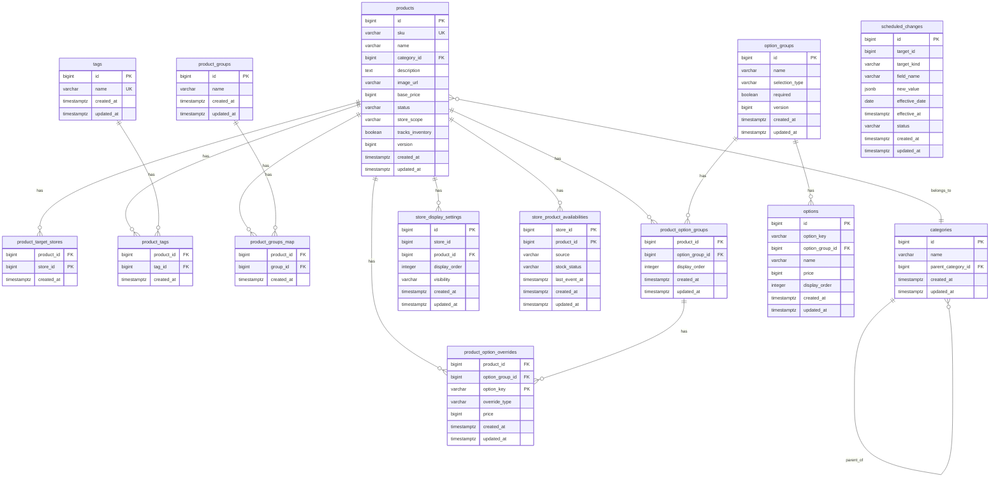

# Catalog ERD

> 문서별 역할과 수정 순서는 [문서 안내](README.md)를 참고한다.

**DBMS**: PostgreSQL · 실제 DDL: [`V1__init.sql`](../src/main/resources/db/migration/V1__init.sql) · 스키마 규칙의 근거: [ADR-0010](adr/0010-schema-conventions-and-time.md)

- **ID**: `BIGINT GENERATED ALWAYS AS IDENTITY` (DB가 생성)
- **금액**: `BIGINT`, 원 단위 정수 (도메인 `Money(Long)`)
- **상태값**: `VARCHAR` + `CHECK` (PostgreSQL ENUM 타입은 쓰지 않음)
- **시각**: `TIMESTAMPTZ` (도메인 `Instant`). 업무 날짜는 `DATE` (업무 시간대 기준)
- **낙관적 잠금**: `products`, `option_groups`에만 `version BIGINT` ([ADR-0013](adr/0013-optimistic-locking-for-product-and-option-group.md)). 다른 테이블의 동시성은 [동시성 처리](#동시성-처리)의 방식으로 다룬다
- **감사 컬럼**: `created_at`/`updated_at`은 DB 시계(`now()`)로 채움
- `store_id`는 Store BC(별도 서비스) 참조라 FK 제약이 없다
 
---

## 다이어그램

> `scheduled_changes`는 `target_id`가 `products.id` 또는 `option_groups.id`를 다형적으로 참조하므로(FK 아님), 다이어그램상 관계선으로 표시하지 않음. `store_display_settings.store_id`, `store_product_availabilities.store_id`, `product_target_stores.store_id`는 Store BC(별도 서비스) 참조이므로 FK로 표시하지 않음.
 
---

## 상태값 (`VARCHAR` + `CHECK`)

| 컬럼 | 허용 값 |
|---|---|
| `products.status` | `DRAFT`, `ACTIVE`, `DISCONTINUED` |
| `products.store_scope` | `ALL`, `LIMITED` |
| `option_groups.selection_type` | `SINGLE`, `MULTI` |
| `scheduled_changes.target_kind` | `PRODUCT`, `OPTION_GROUP`, `PRODUCT_OPTION_GROUP` |
| `scheduled_changes.status` | `PENDING`, `APPLIED`, `CANCELLED`, `FAILED` |
| `store_display_settings.visibility` | `VISIBLE`, `HIDDEN` |
| `store_product_availabilities.stock_status` | `ON_SALE`, `SOLD_OUT` |
| `store_product_availabilities.source` | `INVENTORY`, `OWNER` |
| `product_option_overrides.override_type` | `PRICE`, `EXCLUDE` |

PostgreSQL ENUM 타입을 쓰지 않는 이유는 [ADR-0010](adr/0010-schema-conventions-and-time.md)에 있다(R2DBC 드라이버 코덱 등록, Exposed 별도 타입, 값 변경의 번거로움). 값을 추가하거나 바꿀 때는 새 마이그레이션에서 `CHECK` 제약을 교체한다.
 
---

## 테이블 상세

### products — 상품 마스터

| 컬럼 | 타입 | 제약 | 설명 |
|---|---|---|---|
| id | BIGINT | PK, identity | |
| sku | VARCHAR | UNIQUE, NULL 허용 | 외부 시스템 연동 키 |
| name | VARCHAR | NOT NULL | 즉시 반영 |
| category_id | BIGINT | FK → categories.id, NOT NULL | 소분류만 참조(도메인이 `ChildCategory` 타입으로 강제) |
| description | TEXT | NULL 허용 | |
| image_url | VARCHAR | NULL 허용 | 표시용 1장 |
| base_price | BIGINT | NOT NULL | 즉시/예약 |
| status | VARCHAR | NOT NULL, 기본 `DRAFT`, CHECK | 전용 액션(activate/discontinue)으로만 변경 |
| store_scope | VARCHAR | NOT NULL, 기본 `ALL`, CHECK | |
| tracks_inventory | BOOLEAN | NOT NULL | 재고형/비재고형 |
| version | BIGINT | NOT NULL, 기본 0 | 낙관적 잠금 ([ADR-0013](adr/0013-optimistic-locking-for-product-and-option-group.md)) |
| created_at / updated_at | TIMESTAMPTZ | NOT NULL | |

### categories — 카테고리 (2단계 계층)

| 컬럼 | 타입 | 제약 | 설명 |
|---|---|---|---|
| id | BIGINT | PK | |
| name | VARCHAR | NOT NULL | 즉시 반영 |
| parent_category_id | BIGINT | FK → categories.id, NULL 허용 | NULL이면 대분류 |
| created_at / updated_at | TIMESTAMPTZ | NOT NULL | |

### tags — 태그 (Notion select 방식)

| 컬럼 | 타입 | 제약 | 설명 |
|---|---|---|---|
| id | BIGINT | PK | |
| name | VARCHAR | UNIQUE, NOT NULL | 동일명 재사용 |
| created_at / updated_at | TIMESTAMPTZ | NOT NULL | |

### product_groups — 상품 그룹 (내부 관리용, 단일 레벨)

| 컬럼 | 타입 | 제약 | 설명 |
|---|---|---|---|
| id | BIGINT | PK | |
| name | VARCHAR | NOT NULL | 즉시 반영 |
| created_at / updated_at | TIMESTAMPTZ | NOT NULL | |

### product_target_stores — 판매 범위(LIMITED) 대상 매장

| 컬럼 | 타입 | 제약 | 설명 |
|---|---|---|---|
| product_id | BIGINT | PK, FK → products.id | |
| store_id | BIGINT | PK | Store BC 참조, FK 없음 |
| created_at | TIMESTAMPTZ | NOT NULL | |

### product_tags / product_groups_map — 연결 테이블

| 컬럼 | 타입 | 제약 |
|---|---|---|
| product_id | BIGINT | PK, FK → products.id |
| tag_id / group_id | BIGINT | PK, FK → tags.id / product_groups.id |
| created_at | TIMESTAMPTZ | NOT NULL |

### option_groups — 옵션 그룹

| 컬럼 | 타입 | 제약 | 설명 |
|---|---|---|---|
| id | BIGINT | PK | |
| name | VARCHAR | NOT NULL | 즉시 반영 |
| selection_type | VARCHAR | NOT NULL, CHECK | SINGLE / MULTI |
| required | BOOLEAN | NOT NULL | |
| version | BIGINT | NOT NULL, 기본 0 | 낙관적 잠금 ([ADR-0013](adr/0013-optimistic-locking-for-product-and-option-group.md)) |
| created_at / updated_at | TIMESTAMPTZ | NOT NULL | |

### options — 개별 옵션

| 컬럼 | 타입 | 제약 | 설명 |
|---|---|---|---|
| id | BIGINT | PK | PUT/스냅샷 시 재발급 가능 |
| option_key | VARCHAR | NOT NULL, `UNIQUE(option_group_id, option_key)` | 논리 식별자, 그룹 내 유일 |
| option_group_id | BIGINT | FK → option_groups.id (삭제 시 CASCADE), NOT NULL | |
| name | VARCHAR | NOT NULL | |
| price | BIGINT | NOT NULL, `CHECK (price >= 0)` | |
| display_order | INTEGER | NOT NULL | 그룹 내 노출 순서 |
| created_at / updated_at | TIMESTAMPTZ | NOT NULL | |

### product_option_groups — 상품 ↔ 옵션그룹 연결

| 컬럼 | 타입 | 제약 | 설명 |
|---|---|---|---|
| product_id | BIGINT | PK, FK → products.id (삭제 시 CASCADE) | |
| option_group_id | BIGINT | PK, FK → option_groups.id (삭제 제한) | 연결한 상품이 있으면 옵션 그룹을 삭제할 수 없다(요구사항 1.9) |
| display_order | INTEGER | NOT NULL | 이 상품 내 옵션그룹 간 순서 |
| created_at / updated_at | TIMESTAMPTZ | NOT NULL | |

### product_option_overrides — 상품별 옵션 예외

| 컬럼 | 타입 | 제약 | 설명 |
|---|---|---|---|
| product_id | BIGINT | PK | |
| option_group_id | BIGINT | PK | |
| option_key | VARCHAR | PK | |
| (FK) | | `(product_id, option_group_id)` → `product_option_groups` (삭제 시 CASCADE) | 예외는 상품-옵션 그룹 연결에 속한다. 연결이 해제되면 함께 삭제 |
| override_type | VARCHAR | NOT NULL, CHECK | `PRICE` 또는 `EXCLUDE` |
| price | BIGINT | NULL 허용, `CHECK (price >= 0)` | `PRICE`일 때만 값 존재 |
| created_at / updated_at | TIMESTAMPTZ | NOT NULL | |
| 제약 | | `CHECK ((override_type='PRICE' AND price IS NOT NULL) OR (override_type='EXCLUDE' AND price IS NULL))` | type-price 정합성 |

### scheduled_changes — 예약 변경 (필드 단위, 00시 고정 적용)

| 컬럼 | 타입 | 제약 | 설명 |
|---|---|---|---|
| id | BIGINT | PK | |
| target_id | BIGINT | NOT NULL | products.id 또는 option_groups.id (다형 참조) |
| target_kind | VARCHAR | NOT NULL, CHECK | |
| field_name | VARCHAR | NOT NULL | 예약 대상 필드명 |
| new_value | JSONB | NOT NULL | |
| effective_date | DATE | NOT NULL | 업무 날짜. 업무 시간대 기준 그 날 00시에 적용 |
| effective_at | TIMESTAMPTZ | NOT NULL | 등록할 때 `effective_date`의 00시를 업무 시간대로 해석해 계산한 순간. 배치는 이 값으로만 대상을 고른다 |
| status | VARCHAR | NOT NULL, 기본 `PENDING`, CHECK | |
| created_at / updated_at | TIMESTAMPTZ | NOT NULL | |
| 제약 | | `UNIQUE(target_id, target_kind, field_name) WHERE status='PENDING'` | 동일 대상·필드 Pending 최대 1건 |

### store_display_settings — 매장별 진열 설정 (점주 소유, Lazy 생성)

| 컬럼 | 타입 | 제약 | 설명 |
|---|---|---|---|
| id | BIGINT | PK | |
| store_id | BIGINT | NOT NULL | Store BC 참조, FK 없음 |
| product_id | BIGINT | FK → products.id, NOT NULL | |
| display_order | INTEGER | NULL 허용 | |
| visibility | VARCHAR | NOT NULL, 기본 `VISIBLE`, CHECK | 점주의 노출 의도 |
| created_at / updated_at | TIMESTAMPTZ | NOT NULL | row 부재 = 기본값(노출)으로 취급 중 |
| 제약 | | `UNIQUE(store_id, product_id)` | |

판매 범위에서 제외된 매장의 row는 삭제한다(요구사항 1.5).

### store_product_availabilities — 매장별 판매 가능 여부

매장별 판매중/품절과 그 출처. 출처는 상품의 재고 추적 여부로 정해지며 이후 바뀌지 않는다.
- `INVENTORY`(재고 추적 상품): 재고관리 서비스 이벤트로만 갱신한다. 상품 상태·판매 범위와 무관하게 유지하며, 판매 범위에서 빠져도 삭제하지 않는다.
- `OWNER`(재고 미추적 상품): 점주가 수동으로 갱신한다. 판매 범위에서 빠지면 삭제(초기화)한다.

| 컬럼 | 타입 | 제약 | 설명 |
|---|---|---|---|
| store_id | BIGINT | PK | Store BC 참조, FK 없음 |
| product_id | BIGINT | PK, FK → products.id | 상품 삭제 시 함께 삭제 |
| source | VARCHAR | NOT NULL, CHECK | `INVENTORY` / `OWNER` |
| stock_status | VARCHAR | NOT NULL, CHECK | 판매중 = `ON_SALE`, 품절 = `SOLD_OUT` |
| last_event_at | TIMESTAMPTZ | NULL 허용 | 마지막으로 반영한 재고 이벤트의 발생 시각(`INVENTORY`만). 이보다 오래되었거나 같은 시각의 이벤트는 무시 |
| created_at / updated_at | TIMESTAMPTZ | NOT NULL | row 부재 = 출처별 기본값(`INVENTORY`는 품절, `OWNER`는 판매중) |
| 제약 | | `CHECK (source = 'INVENTORY' OR last_event_at IS NULL)` | `OWNER` 출처에는 재고 이벤트 시각이 없다 |
 
---

## 삭제 시 동작 (FK)

| 삭제 대상 | 함께 삭제 (CASCADE) | 삭제 제한 |
|---|---|---|
| `products` | 대상 매장, 태그·그룹 연결, 옵션 그룹 연결과 상품별 예외, 매장 진열 설정, 매장 판매 가능 여부 | — |
| `option_groups` | 옵션 | 연결한 상품이 있으면 삭제 불가 |
| `categories` | — | 참조하는 상품이나 하위 카테고리가 있으면 삭제 불가 |
| `tags`, `product_groups` | 상품과의 연결 (요구사항 1.7, 1.8의 자동 제거) | — |
| `product_option_groups` (연결 해제) | 그 연결의 상품별 예외 | — |

삭제 제한은 DB에서도 막지만, 사용자에게 이유를 알려 주기 위해 application이 먼저 확인하고 `DomainException`으로 거부한다([도메인 모델](domain-model.md#application-레이어에서-강제-cross-aggregate)).

---

## 동시성 처리

| 상황 | 문제 | 처리 |
|---|---|---|
| `scheduled_changes` 취소 후 재등록 | Pending 중복 생성 위험 | `SELECT ... FOR UPDATE`로 기존 row 잠그고 한 트랜잭션 처리 |
| `scheduled_changes` 00시 배치 적용 | 여러 워커의 중복 처리 | `SELECT ... FOR UPDATE SKIP LOCKED` |
| `store_display_settings` Lazy 생성 | 동시 요청 시 중복 row | `INSERT ... ON CONFLICT (store_id, product_id) DO UPDATE` |
| `store_product_availabilities` 재고 이벤트 반영 (`INVENTORY`) | 중복 수신·순서 역전으로 오래된 값이 덮어씀 | `INSERT ... ON CONFLICT (store_id, product_id) DO UPDATE ... WHERE store_product_availabilities.last_event_at IS NULL OR excluded.last_event_at > store_product_availabilities.last_event_at` |
| `store_product_availabilities` 점주 수동 품절 첫 생성 (`OWNER`) | 동시 요청 시 중복 row | `INSERT ... ON CONFLICT (store_id, product_id) DO UPDATE` |
| `options` 최소 1개/0개 검증 | 검증-실행 사이 레이스 | 옵션 그룹 단위 비관적 락 |
| `products.status` 전이 검증 | 동시 요청 시 중복 전이 | Product row 단위 비관적 락 |
| `products`, `option_groups` 전체 교체·예외 지정 | 오래된 화면으로 저장해 다른 변경을 덮어씀 | 낙관적 잠금: `UPDATE … WHERE id = ? AND version = ?`, 바뀐 행이 0개면 충돌(409). 저장할 때마다 `version` + 1 ([ADR-0013](adr/0013-optimistic-locking-for-product-and-option-group.md)) |
| `categories` 부모 변경·소분류 추가 | 부모 후보가 동시에 소분류로 바뀌어 3단계가 됨 | 부모 후보 행 `SELECT … FOR UPDATE` |
| `tags` 같은 이름 동시 등록 | 중복 태그 | `INSERT … ON CONFLICT (name) DO NOTHING` 뒤 조회 |
 
---

## 감사 컬럼 정책

- 단독 엔티티 테이블: `created_at` + `updated_at`
- 연결 테이블: `created_at`만 (값 변경이 있는 `product_option_groups`, `product_option_overrides`는 `updated_at` 포함)
- `created_by`/`updated_by`: 계정/권한 체계 확정 후 FK 없는 느슨한 참조(actor_id)로 추가 예정. 상세 변경 이력이 필요해지면 별도 감사 로그 테이블 검토
---

## 확인 필요 (미결정)

1. Store BC의 PK 타입도 BIGINT로 통일할지 (Store BC 설계 전이므로 미확정)
2. `created_by`/`updated_by` — 계정/권한 체계 확정 후 추가
