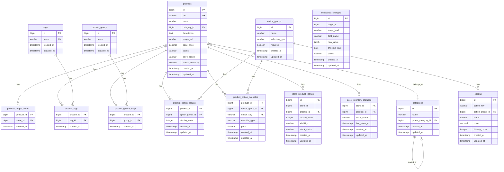

# Catalog ERD

> 문서별 역할과 수정 순서는 [문서 안내](README.md)를 참고한다.

**DBMS**: PostgreSQL · PK/FK: `BIGINT` · `store_id`는 Store BC(별도 서비스) 참조 (FK 제약 없음)
 
---

## 다이어그램



> `scheduled_changes`는 `target_id`가 `products.id` 또는 `option_groups.id`를 다형적으로 참조하므로(FK 아님), 다이어그램상 관계선으로 표시하지 않음. `store_product_listings.store_id`, `store_inventory_statuses.store_id`, `product_target_stores.store_id`는 Store BC(별도 서비스) 참조이므로 FK로 표시하지 않음.
 
---

## ENUM 타입

```sql
CREATE TYPE product_status       AS ENUM ('DRAFT', 'ACTIVE', 'DISCONTINUED');
CREATE TYPE store_scope          AS ENUM ('ALL', 'LIMITED');
CREATE TYPE selection_type       AS ENUM ('SINGLE', 'MULTI');
CREATE TYPE schedule_target      AS ENUM ('PRODUCT', 'OPTION_GROUP', 'PRODUCT_OPTION_GROUP');
CREATE TYPE schedule_status      AS ENUM ('PENDING', 'APPLIED', 'CANCELLED', 'FAILED');
CREATE TYPE listing_visibility   AS ENUM ('VISIBLE', 'HIDDEN');
CREATE TYPE listing_stock_status AS ENUM ('ON_SALE', 'SOLD_OUT');
CREATE TYPE override_type        AS ENUM ('PRICE', 'EXCLUDE');
```

값 추가는 `ALTER TYPE ... ADD VALUE`로 가능(단, 같은 트랜잭션 내 즉시 사용 불가). 값 삭제/변경이 잦을 것으로 예상되면 해당 컬럼만 `VARCHAR + CHECK`로 개별 전환 검토.
 
---

## 테이블 상세

### products — 상품 마스터

| 컬럼 | 타입 | 제약 | 설명 |
|---|---|---|---|
| id | BIGINT | PK | |
| sku | VARCHAR | UNIQUE, NULL 허용 | 외부 시스템 연동 키 |
| name | VARCHAR | NOT NULL | 즉시 반영 |
| category_id | BIGINT | FK → categories.id, NOT NULL | 소분류만 참조 |
| description | TEXT | NULL 허용 | |
| image_url | VARCHAR | NULL 허용 | 표시용 1장 |
| base_price | DECIMAL | NOT NULL | 즉시/예약 |
| status | product_status | NOT NULL, 기본 `DRAFT` | 전용 액션(activate/discontinue)으로만 변경 |
| store_scope | store_scope | NOT NULL, 기본 `ALL` | |
| tracks_inventory | BOOLEAN | NOT NULL | 재고형/비재고형 |
| created_at / updated_at | TIMESTAMP | NOT NULL | |

### categories — 카테고리 (2단계 계층)

| 컬럼 | 타입 | 제약 | 설명 |
|---|---|---|---|
| id | BIGINT | PK | |
| name | VARCHAR | NOT NULL | 즉시 반영 |
| parent_category_id | BIGINT | FK → categories.id, NULL 허용 | NULL이면 대분류 |
| created_at / updated_at | TIMESTAMP | NOT NULL | |

### tags — 태그 (Notion select 방식)

| 컬럼 | 타입 | 제약 | 설명 |
|---|---|---|---|
| id | BIGINT | PK | |
| name | VARCHAR | UNIQUE, NOT NULL | 동일명 재사용 |
| created_at / updated_at | TIMESTAMP | NOT NULL | |

### product_groups — 상품 그룹 (내부 관리용, 단일 레벨)

| 컬럼 | 타입 | 제약 | 설명 |
|---|---|---|---|
| id | BIGINT | PK | |
| name | VARCHAR | NOT NULL | 즉시 반영 |
| created_at / updated_at | TIMESTAMP | NOT NULL | |

### product_target_stores — 판매 범위(LIMITED) 대상 매장

| 컬럼 | 타입 | 제약 | 설명 |
|---|---|---|---|
| product_id | BIGINT | PK, FK → products.id | |
| store_id | BIGINT | PK | Store BC 참조, FK 없음 |
| created_at | TIMESTAMP | NOT NULL | |

### product_tags / product_groups_map — 연결 테이블

| 컬럼 | 타입 | 제약 |
|---|---|---|
| product_id | BIGINT | PK, FK → products.id |
| tag_id / group_id | BIGINT | PK, FK → tags.id / product_groups.id |
| created_at | TIMESTAMP | NOT NULL |

### option_groups — 옵션 그룹

| 컬럼 | 타입 | 제약 | 설명 |
|---|---|---|---|
| id | BIGINT | PK | |
| name | VARCHAR | NOT NULL | 즉시 반영 |
| selection_type | selection_type | NOT NULL | SINGLE / MULTI |
| required | BOOLEAN | NOT NULL | |
| created_at / updated_at | TIMESTAMP | NOT NULL | |

### options — 개별 옵션

| 컬럼 | 타입 | 제약 | 설명 |
|---|---|---|---|
| id | BIGINT | PK | PUT/스냅샷 시 재발급 가능 |
| option_key | VARCHAR | NOT NULL | 논리 식별자, 그룹 내 유일 |
| option_group_id | BIGINT | FK → option_groups.id, NOT NULL | |
| name | VARCHAR | NOT NULL | |
| price | DECIMAL | NOT NULL, `CHECK (price >= 0)` | |
| display_order | INTEGER | NOT NULL | 그룹 내 노출 순서 |
| created_at / updated_at | TIMESTAMP | NOT NULL | |

### product_option_groups — 상품 ↔ 옵션그룹 연결

| 컬럼 | 타입 | 제약 | 설명 |
|---|---|---|---|
| product_id | BIGINT | PK, FK → products.id | |
| option_group_id | BIGINT | PK, FK → option_groups.id | |
| display_order | INTEGER | NOT NULL | 이 상품 내 옵션그룹 간 순서 |
| created_at / updated_at | TIMESTAMP | NOT NULL | |

### product_option_overrides — 상품별 옵션 예외

| 컬럼 | 타입 | 제약 | 설명 |
|---|---|---|---|
| product_id | BIGINT | PK, FK → products.id | |
| option_group_id | BIGINT | PK, FK → option_groups.id | |
| option_key | VARCHAR | PK | |
| override_type | override_type | NOT NULL | `PRICE` 또는 `EXCLUDE` |
| price | DECIMAL | NULL 허용, `CHECK (price >= 0)` | `PRICE`일 때만 값 존재 |
| created_at / updated_at | TIMESTAMP | NOT NULL | |
| 제약 | | `CHECK ((override_type='PRICE' AND price IS NOT NULL) OR (override_type='EXCLUDE' AND price IS NULL))` | type-price 정합성 |

### scheduled_changes — 예약 변경 (필드 단위, 00시 고정 적용)

| 컬럼 | 타입 | 제약 | 설명 |
|---|---|---|---|
| id | BIGINT | PK | |
| target_id | BIGINT | NOT NULL | products.id 또는 option_groups.id (다형 참조) |
| target_kind | schedule_target | NOT NULL | |
| field_name | VARCHAR | NOT NULL | 예약 대상 필드명 |
| new_value | JSONB | NOT NULL | |
| effective_date | DATE | NOT NULL | 00시 고정 적용 |
| status | schedule_status | NOT NULL, 기본 `PENDING` | |
| created_at / updated_at | TIMESTAMP | NOT NULL | |
| 제약 | | `UNIQUE(target_id, target_kind, field_name) WHERE status='PENDING'` | 동일 대상·필드 Pending 최대 1건 |

### store_product_listings — 매장별 진열/노출 (점주 소유, Lazy 생성)

| 컬럼 | 타입 | 제약 | 설명 |
|---|---|---|---|
| id | BIGINT | PK | |
| store_id | BIGINT | NOT NULL | Store BC 참조, FK 없음 |
| product_id | BIGINT | FK → products.id, NOT NULL | |
| display_order | INTEGER | NULL 허용 | |
| visibility | listing_visibility | NOT NULL, 기본 `VISIBLE` | |
| stock_status | listing_stock_status | NOT NULL, 기본 `ON_SALE` | 재고 미추적 상품의 점주 수동 품절에만 사용. 재고 추적 상품은 `store_inventory_statuses`를 따름 |
| created_at / updated_at | TIMESTAMP | NOT NULL | row 부재 = 기본값으로 노출 중 |
| 제약 | | `UNIQUE(store_id, product_id)` | |

### store_inventory_statuses — 매장별 재고 상태 (재고관리 서비스 이벤트 투영)

재고 추적 상품의 매장별 품절 여부. 원본은 재고관리 서비스이며, 이 테이블은 그 이벤트로만 갱신된다. 상품 상태·판매 범위와 무관하게 유지되며, 판매 범위 변경으로 `store_product_listings`가 삭제돼도 이 테이블은 삭제하지 않는다.

| 컬럼 | 타입 | 제약 | 설명 |
|---|---|---|---|
| store_id | BIGINT | PK | Store BC 참조, FK 없음 |
| product_id | BIGINT | PK, FK → products.id | 상품 삭제 시 함께 삭제 |
| stock_status | listing_stock_status | NOT NULL | 재고 있음 = `ON_SALE`, 없음 = `SOLD_OUT` |
| last_event_at | TIMESTAMP | NOT NULL | 마지막으로 반영한 재고 이벤트의 발생 시각. 이보다 오래된 이벤트는 무시(순서 역전 방지) |
| created_at / updated_at | TIMESTAMP | NOT NULL | row 부재 = 재고 이벤트를 받은 적 없음 = 재고 0(품절) |
 
---

## 동시성 처리

| 상황 | 문제 | 처리 |
|---|---|---|
| `scheduled_changes` 취소 후 재등록 | Pending 중복 생성 위험 | `SELECT ... FOR UPDATE`로 기존 row 잠그고 한 트랜잭션 처리 |
| `scheduled_changes` 00시 배치 적용 | 여러 워커의 중복 처리 | `SELECT ... FOR UPDATE SKIP LOCKED` |
| `store_product_listings` Lazy 생성 | 동시 요청 시 중복 row | `INSERT ... ON CONFLICT (store_id, product_id) DO UPDATE` |
| `store_inventory_statuses` 재고 이벤트 반영 | 중복 수신·순서 역전으로 오래된 값이 덮어씀 | `INSERT ... ON CONFLICT (store_id, product_id) DO UPDATE ... WHERE excluded.last_event_at > store_inventory_statuses.last_event_at` |
| `options` 최소 1개/0개 검증 | 검증-실행 사이 레이스 | 옵션 그룹 단위 비관적 락 |
| `products.status` 전이 검증 | 동시 요청 시 중복 전이 | Product row 단위 비관적 락 |
 
---

## 감사 컬럼 정책

- 단독 엔티티 테이블: `created_at` + `updated_at`
- 연결 테이블: `created_at`만 (값 변경이 있는 `product_option_groups`, `product_option_overrides`는 `updated_at` 포함)
- `created_by`/`updated_by`: 계정/권한 체계 확정 후 FK 없는 느슨한 참조(actor_id)로 추가 예정. 상세 변경 이력이 필요해지면 별도 감사 로그 테이블 검토
---

## 확인 필요 (미결정)

1. Store BC의 PK 타입도 BIGINT로 통일할지 (Store BC 설계 전이므로 미확정)
2. `created_by`/`updated_by` — 계정/권한 체계 확정 후 추가
